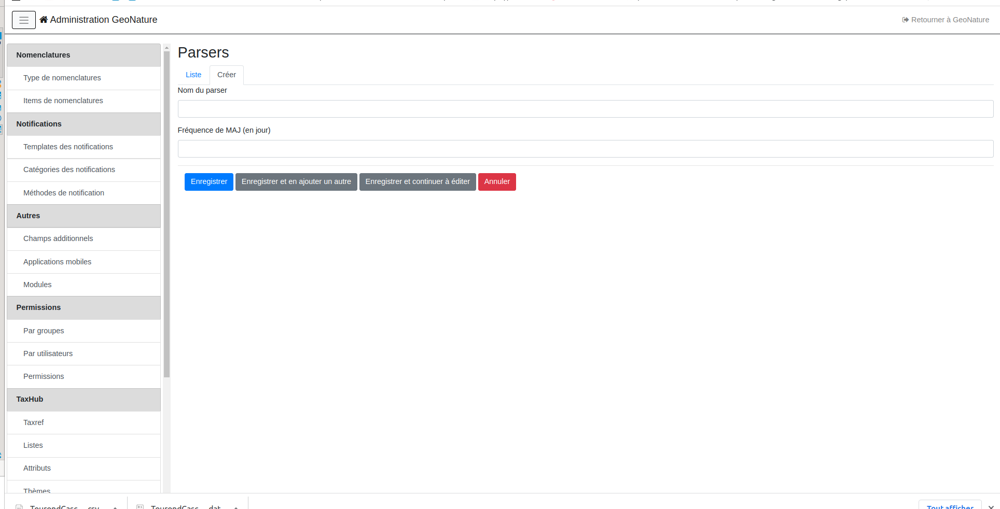
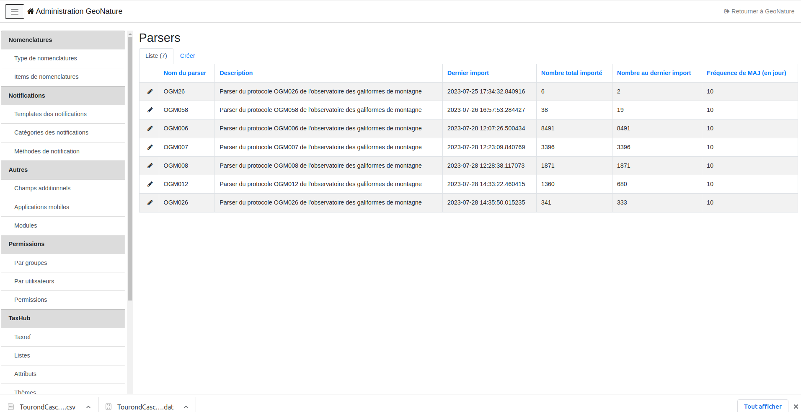

# Installation

    #Depuis le venv de GeoNature
    source <GeoNature_DIR>/backend/venv/bin/activate
    # depuis le répertoire API2GN
    pip install .

Copier le fichier d'exemple `var/config/parsers.example.py` en `var/config/parsers.py`

## Commandes 

* Lister les parsers disponibles

    ```    
    geonature parser list
    ```

- Lancer un parser
    ```
    geonature parser run <PARSER_NAME>
    ```

### Créer ses propres parser

Pour construire un parser, créez un fichier `parsers.py` dans le répertoire `api2gn/var/config`. Vous pouvez vous inspirer du fichier du fichier `parsers.py.exemple` présent dans ce dossier.
Un parser est une classe Python, qui hérite d'autre parser pour en faciliter l'écriture (cf `GeoNatureParser`)
Le principe d'un parser est qu'il va se connecter à une API tierce et essayer d'insérer les données qui lui sont renvoyées dans la Synthese de GeoNature.
Un parser va donc "décrire" le procesus d'échange de données entre ces deux entités.
Pour cela, la classe décrivant le parser doit définir plusieurs attributs :

- `name(str)`: le nom du parser
- `url(str)`: l'url du flux auquel on se connecte
- `mapping(dict[str, str], default={}`): dictionnaire permettant de faire matcher les champs source et les champs de destination. Ici la clé est le nom de la colonne dans le GeoNature de destination et la valeur le nom du champs dans la source externe
- `constant_field(dict[str, any], default={}`) : dictionnaire permettant de passer des constantes lorsque la valeur attendue dans la Synthese n'est pas présente dans le flux externe. La clé est le nom de la colonne dans la Synthèse et la valeur, la constante à insérer
- `dynamic_fields(dict[str, func], default={}`) : dictionnaire permettant de passer des fonctions calculant des valeurs dynamiques en fonction des valeurs de chaque ligne (la fonction prend en paramètre `row`: la ligne courante renvoyée par l'API)
- `additionnal_fields(dict[str, str], default={}`) : dictionnaire permettant remplir le champs `additionnal_data` de la synthese avec des champs de la source. La clé du dictionnaire correspond au nom que l'on veut avoir pour le champs additionnel dans la synthese. La valeur du dictionnaire correspond au nom du champ dans la source externe.
- `api_filters(dict[str, any])`: dictionnaire de filtres à l'API. La clé étant le champs à filtrer, la valeur étant la valeur du filtre. Fonctionnel uniquement avec le `JSONParser`, pour le `WFSParser` il est conseillé d'utiliser la fonction `late_filter_feature(self, feature)` qui opère des filtres à postériori.


Les champs `mapping`, `constant_field` et `dynamic_fields` sont optionnels. S'il ne sont pas fourni, le mapping se fait sur le parser duquel hérite votre parser (`GeoNatureParser` par exemple)

## Configurer un parser "GeoNature"

Le module met à disposition la classe `GeoNatureParser` (`api2gn.geonature_parser`) permettant de construire un parser connectable à un autre GeoNature. Le GeoNature auquel on souhaite se connecter doit posséder un module d'export pour se connecter à son API. Le mapping par défaut de la classe `GeoNatureParser` est basé sur l'export `Synthese SINP` fourni avec le module, mais il est possible de configurer ce mapping en surchouchant les champs `mapping`, `constant_fields`, `dynamic_fields` et `additionnal_fields` et   (voir ci-dessus).
Le mapping fournit par `GeoNatureParser` est le suivant : 

    mapping = {
        "unique_id_sinp": "id_perm_sinp",
        "unique_id_sinp_grp": "id_perm_grp_sinp",
        "date_min": "date_debut",
        "date_max": "date_fin",
        "cd_nom": "cd_nom",
        "nom_cite": "nom_cite",
        "count_min": "nombre_min",
        "count_max": "nombre_max",
        "altitude_min": "altitude_min",
        "altitude_max": "altitude_max",
        "depth_max": "profondeur_min",
        "observers": "observateurs",
        "determiner": "determinateur",
        "sample_number_proof": "numero_preuve",
        "digital_proof": "preuve_numerique",
        "non_digital_proof": "preuve_non_numerique",
        "comment_context": "comment_releve",
        "comment_description": "comment_occurrence",
        "meta_create_date": "date_creation",
        "meta_update_date": "date_modification",
        "cd_hab": "code_habitat",
        "place_name": "nom_lieu",
        "precision": "precision",
        "grp_method": "methode_regroupement",
        "id_nomenclature_info_geo_type": "type_info_geo",
        "id_nomenclature_grp_typ": "type_regroupement",
        "id_nomenclature_behaviour": "comportement",
        "id_nomenclature_obs_technique": "technique_obs",
        "id_nomenclature_bio_status": "statut_biologique",
        "id_nomenclature_bio_condition": "etat_biologique",
        "id_nomenclature_naturalness": "naturalite",
        "id_nomenclature_exist_proof": "preuve_existante",
        "id_nomenclature_obj_count": "objet_denombrement",
        "id_nomenclature_sensitivity": "niveau_sensibilite",
        "id_nomenclature_observation_status": "statut_observation",
        "id_nomenclature_blurring": "floutage_dee",
        "id_nomenclature_source_status": "statut_source",
        "id_nomenclature_determination_method": "methode_determination",
    }


pour le surcharger, mettez seulement à jour les champs necessaire.
Les champs `id_dataset` et `id_source` sont volontairement omis du mapping et doivent être passé par des constantes via le champs `constant_fields`

Exemple de parser basé sur `GeoNatureParser`

```python

# parser de base
class GeoNatureParser1(GeoNatureParser):
        name = "GN Test"
        url = "http://127.0.0.1:8000/exports/api/1"
        # ne récupérer uniquement les données du JDD de cet UUID
        api_filters = {"jdd_uuid": "4d331cae-65e4-4948-b0b2-a11bc5bb46c2"}
        # le champ id_source sera toujours 2
        constant_fields = dict(
            id_source=2,
            id_dataset=1
        )

# fonction utilitaire utilisé dans le second parser
def find_id_dataset(row):
    if row["jdd_nom"] == "bidule":
        return 1
    else:
        return 2

class GeoNatureParser2(GeoNatureParser):
    name = "GN Local"
    url = "http://127.0.0.1:8000/exports/api/1"
    constant_fields = dict(
        id_source=2,
    )
    dynamic_fields = dict(
        # champs dynamique utilisant une fonction utilitaire
        id_dataset=find_id_dataset,
        # champs utilitaire utilisant une fonction lambda
        altitude_max=lambda row: row["altitude_max"] * 2,
    )

```

## Lancement automatique des parsers

En plus de pouvoir lancer les parsers depuis le terminal, le module offre la possibilité de les lancer automatiquement grâce à des tâches planifiés.
Pour cela, il faut ajouter les parsers que l'on souhaite synchroniser dans le backoffice GeoNature (section API2GN/Parsers)

Renseignez le nom de la classe dans "Nom du parser", puis la fréquence à laquelle le parser doit être lancé.






## Développer un nouveau parser

Il est possible de développer de nouveaux parser en s'appuyant sur les classes déjà présentes (`JSONParser` et `WFSParser`). Toutes les méthodes de ces classes sont surcouchables.
Les méthodes principales sont :

- `next_row()` fonction retournant les lignes de la source sour forme d'un itérable
- `build_object(row)` fonction construisant un objet `Synthese` à partir d'une `row`
- `start()` fonction contenant les actions à réaliser avant le début d'un import
- `end()` fonction contenant les actions à réaliser à la fin d'un import
- `run()` fonction de haut niveau executant toutes les méthodes précédentes

Attributes surcouchable:

- `limit (default=100)`: nombre de ligne renvoyé à chaque appel API
- `page_parameter (default="page")`: nom du paramètre de l'API pour la pagination
- `limit_parameter (default="limit")`: nom du paramètre de l'API pour la limite
- `items (default=None)`: lorsque l'API est chargée, les données sont mis dans l'attribut `self.root`. Si les données de l'API ne sont pas directement à la racine de `self.root`, il est possible de le définit ici.
- `progress_bar (default=Fakse)`: afficher une bar de progression lors de l'execution de la commande
- `total (default=None)`: propriété definissant ou trouver le nombre total d'item renvoyé par l'API (à partir de `self.root` - voir si dessous). (Obligatoire si `progress_bar=True`)


```python

    @property
    def items(self):
        return self.root["mon_attribut"]
    @property
    def total(self):
        return self.root["total_item"]

```

